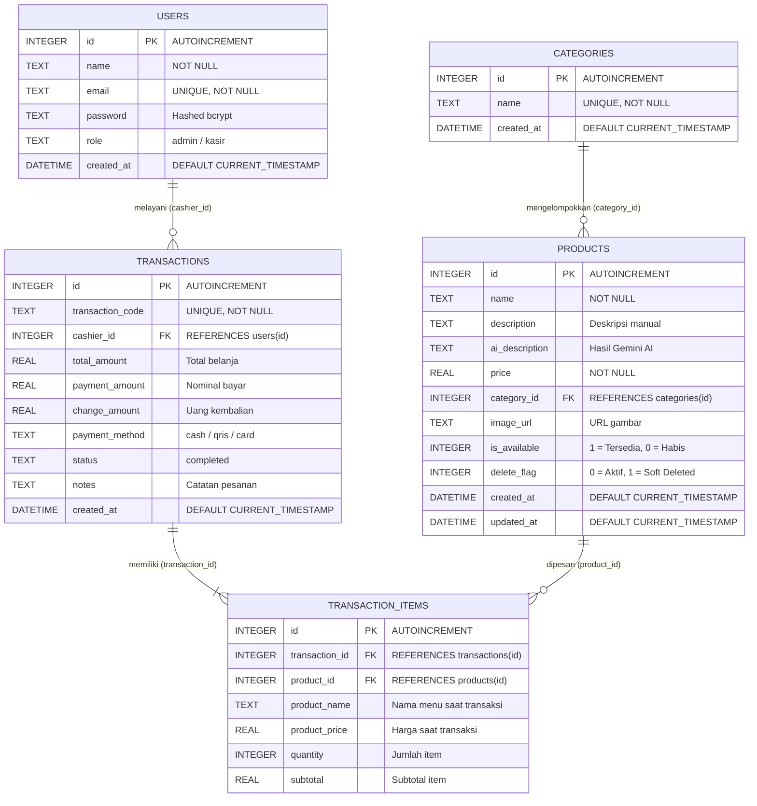
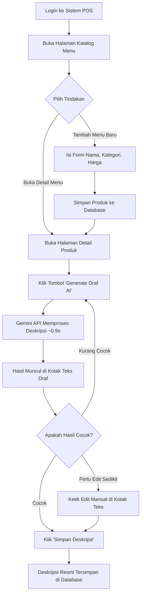
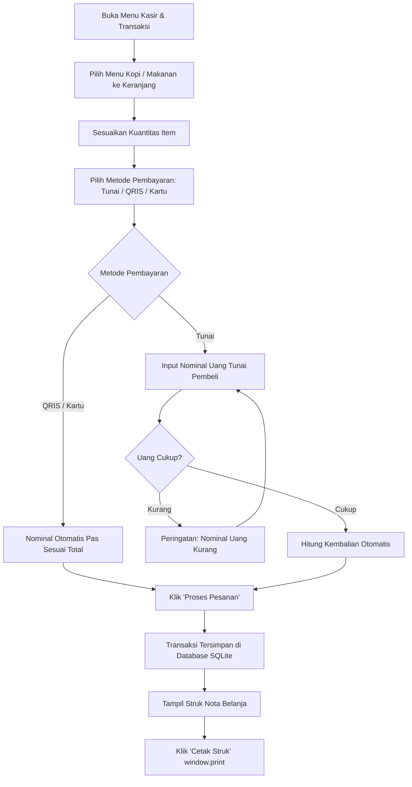

# Product Requirements Document (PRD)
## Sistem Kasir (POS) Coffee Shop dengan AI Generate Deskripsi Menu — BrewMate POS

| | |
|---|---|
| **Nama Produk** | BrewMate POS (Sistem Kasir Coffee Shop + Gemini AI) |
| **Jenis Dokumen** | PRD (Product Requirements Document) |
| **Mata Kuliah** | PAW (Pengembangan Aplikasi Web) — Final Project |
| **Kelompok** | Kelompok 1 |
| **Repositori** | [github.com/wpiskaa/FINAL-PROJECT-KELOMPOK1](https://github.com/wpiskaa/FINAL-PROJECT-KELOMPOK1) |
| **Metode Pengembangan** | Waterfall (Analisis → Desain → Implementasi → Pengujian) |
| **Versi Dokumen** | 1.0 (Final Disetujui) |
| **Status** | ✅ Selesai & Terverifikasi (100% Tested) |

---

## 1. Latar Belakang & Tujuan

### 1.1 Latar Belakang
Kasir coffee shop sering harus menjelaskan detail menu secara manual dan berulang ke tiap pelanggan, yang memakan waktu dan rawan tidak konsisten antar kasir. Sistem kasir (POS) **BrewMate POS** ini dibangun untuk mendigitalkan proses transaksi sekaligus menghadirkan fitur AI (Google Gemini API) yang otomatis membuat deskripsi menu yang estetik, menggugah selera, dan profesional, sehingga informasi yang disampaikan ke pelanggan lebih cepat didapat, konsisten, dan relevan.

### 1.2 Tujuan Produk
- Mempercepat dan merapikan proses transaksi kasir dari pencatatan pesanan hingga pembayaran dan cetak struk nota.
- Mengurangi beban kasir dalam menjelaskan menu secara manual lewat deskripsi otomatis berbasis AI.
- Memberi pelanggan informasi menu yang jelas dan konsisten di setiap transaksi.
- Menjadi capstone project PAW yang didokumentasikan dengan metodologi Waterfall dan diuji secara terukur end-to-end (100% test passed).

### 1.3 Target Pengguna
| Peran | Deskripsi |
|---|---|
| **Admin** | Akses penuh: login dashboard analitik, kelola menu produk (CRUD), kelola kategori, generate/edit deskripsi AI, pantau laporan omzet penjualan |
| **Kasir** | Login sistem, akses kasir POS, buat transaksi pesanan, cetak struk pembayaran, lihat riwayat penjualan |
| **Pelanggan** | Menerima informasi deskripsi menu yang jelas, estetik, dan konsisten saat pemesanan |

---

## 2. Ruang Lingkup (Scope)

### 2.1 In-Scope
- 🔐 **Autentikasi & Otorisasi**: Login berbasis JWT untuk role Admin dan Kasir, dilengkapi fitur *Quick Role Switcher*.
- 📊 **Dashboard Analitik**: Statistik pendapatan harian & bulanan, grafik omzet 7 hari (Recharts), produk terlaris, dan kategori terlaris.
- ☕ **Katalog & Manajemen Menu (Product List)**: CRUD produk, filter kategori, search bar, filter rentang harga (Min & Max Price), dan tombol *Quick AI Generate*.
- 🤖 **AI Deskripsi Menu (Gemini API)**: Auto-generate deskripsi menu sub-second (<1 detik) dengan alur draf, review, manual edit, dan simpan.
- 📋 **Detail Produk (Product Detail)**: Menampilkan detail menu, kategori, status ketersediaan, serta pengeditan deskripsi hasil AI secara interaktif.
- 🛒 **Kasir & Transaksi POS**: Keranjang belanja real-time, metode pembayaran (Tunai, QRIS, Debit/Kartu), kalkulasi kembalian otomatis, dan cetak struk belanja (*thermal receipt print*).
- 📜 **Riwayat Penjualan (History)**: Filter riwayat per tanggal, akordeon rincian transaksi, dan cetak ulang struk.
- 👥 **Informasi Tim**: Modal informasi kelompok dan pengembang di sidebar.

### 2.2 Out-of-Scope (untuk versi final project ini)
- Payment gateway pihak ketiga (pembayaran online real-time dengan bank API) — pembayaran dicatat dan divalidasi di kasir (tunai / QRIS / kartu).
- Nomor antrian fisik atau notifikasi SMS/WhatsApp ke pelanggan.
- Aplikasi mobile native (aplikasi berbasis Web Responsive Desktop & Tablet POS).
- Manajemen multi-cabang (fokus pada single-store coffee shop).

---

## 3. Tech Stack

| Layer | Teknologi yang Digunakan | Keterangan & Rationale |
|---|---|---|
| **Frontend Framework** | React 18 + Vite | SPA modern berbasis komponen, fast rendering & instant HMR |
| **Styling & UI** | Tailwind CSS v3 + Lucide Icons | Tema kustom *Warm Cream & Coffee* bergaya POS modern |
| **Data Visualization** | Recharts | Grafik area tren pendapatan 7 hari interaktif di dashboard |
| **Backend Framework** | Node.js + Express.js | Arsitektur RESTful API terstruktur, modular, dan terpusat |
| **Database** | SQLite via `better-sqlite3` | SQLite berkinerja tinggi dengan mode WAL, indexing query, & in-memory caching |
| **Autentikasi & Keamanan** | JWT (`jsonwebtoken`) + `bcryptjs` | Enkripsi password salt 10 putaran, token-based authentication (8 jam) |
| **AI Engine** | Google Gemini API (`gemini-3.5-flash-lite`) | Model latensi ultra-rendah (<1s) dengan fallback kategori dinamis |
| **Notifikasi** | React Hot Toast | Toast notification elegan untuk respon aksi pengguna |

---

## 4. Struktur Tim & Pembagian Kerja Final

| No | Anggota | NIM | Role & Fokus Pekerjaan |
|:---:|---|---|---|
| 1 | **Safira Dwi Khairunisa** | `20240140173` | **Project Lead & Frontend Developer** • Branding & tema visual *Warm Cream & Coffee* • Sidebar Layout & integrasi komponen `TeamInfoModal.jsx` • Review dan merge Pull Request anggota |
| 2 | **Anneira Nur Khairani** | `20240140178` | **Frontend Developer** • Fitur Filter Rentang Harga (Min & Max Price) di `ProductsPage.jsx` • Desain Struk Pembayaran Nota (*Thermal Receipt*) & fungsi cetak struk (`window.print`) |
| 3 | **Rossa Kayla Isma Aziz** | `20240140215` | **UI/UX & Testing Specialist** • Validasi ketat form input produk (nama min 3 huruf, harga > 0) di `ProductFormModal.jsx` • Desain Empty State dinamis saat data/riwayat kosong • Dokumentasi visual 8 tangkapan layar di `docs/screenshots/` |
| 4 | **Ilham Saputra** | `20240140118` | **Backend & Database Developer** • Optimasi SQLite Engine (PRAGMA WAL, Memory Cache, Indexing) • Dokumentasi teknis `backend/database.md` & Mermaid ERD • Sentralisasi konfigurasi auth JWT, endpoint kategori, & query `top_categories` |
| 5 | **Hafiz Kurniawan** | `20240140024` | **Backend & AI Research Developer** • Tuning prompt Bahasa Indonesia khusus coffee shop di `geminiHelper.js` • Optimasi performa AI ke model `gemini-3.5-flash-lite` (sub-second response) • Implementasi sistem smart fallback per-kategori |

---

## 5. User Stories & Matriks Ketercapaian

| ID | Sebagai | Saya ingin | Agar | Status Ketercapaian |
|---|---|---|---|:---:|
| **US-01** | Admin / Kasir | Login ke sistem dengan email & password terverifikasi | Bisa mengakses dashboard dan menu POS sesuai hak akses | ✅ **Terpenuhi** |
| **US-02** | Kasir | Melihat daftar produk dengan filter kategori, pencarian, dan batas harga | Tahu menu apa saja yang tersedia untuk dijual secara cepat | ✅ **Terpenuhi** |
| **US-03** | Admin / Kasir | Men-generate deskripsi menu otomatis dengan Gemini AI | Tidak perlu menulis manual dan deskripsi menu tetap konsisten & estetik | ✅ **Terpenuhi** |
| **US-04** | Kasir / Pelanggan | Melihat detail produk beserta deskripsi lengkap hasil AI yang bisa diedit | Informasi rasa, bahan, dan karakter menu jelas sebelum dipesan | ✅ **Terpenuhi** |
| **US-05** | Kasir | Mencatat pesanan, memilih metode bayar, dan menghitung kembalian otomatis | Transaksi kasir tercatat rapi, cepat, dan struk nota dapat dicetak | ✅ **Terpenuhi** |

---

## 6. Kebutuhan Fungsional (Functional Requirements)

### 6.1 Login & Dashboard
- **FR-1.1:** Sistem menyediakan form login untuk Admin dan Kasir dengan fitur *Quick Role Switch*.
- **FR-1.2:** Dashboard menampilkan ringkasan analitik: Pendapatan Hari Ini, Pendapatan Bulan Ini, Total Menu Aktif, Status AI, Grafik Tren Penjualan 7 Hari, Produk Terlaris, dan Kategori Terlaris.
- **FR-1.3:** Rute aplikasi diproteksi oleh *ProtectedRoute* JWT, mencegah akses tanpa login.

### 6.2 Product List
- **FR-2.1:** Kasir/Admin dapat melihat daftar seluruh produk beserta kategori, harga, dan ketersediaan stok.
- **FR-2.2:** Admin dapat menambah, mengubah, dan menghapus (soft-delete) data produk.
- **FR-2.3:** Setiap kartu produk memiliki tombol **"Quick AI Generate"** untuk memperbarui deskripsi secara instan.
- **FR-2.4:** Sistem menampilkan loading indicator saat proses generate AI berlangsung.
- **FR-2.5:** Filter pencarian teks dan filter rentang harga (Min & Max Price) berfungsi secara responsif.

### 6.3 Product Detail
- **FR-3.1:** Halaman detail produk menampilkan nama, kategori, harga, status stok, waktu pendaftaran, dan deskripsi menu.
- **FR-3.2:** Terdapat tombol **"Generate Draf AI"** yang menghasilkan variasi teks baru secara dinamis ke dalam textarea yang dapat diedit manual (*human-in-the-loop*).
- **FR-3.3:** Terdapat tombol **"Simpan Deskripsi"** untuk menyimpan teks yang disetujui ke database dan tombol **"Reset"** untuk membatalkan perubahan draf.

### 6.4 Transaksi & Pembayaran
- **FR-4.1:** Kasir dapat memilih produk, menambah/mengurangi kuantitas pesanan ke keranjang belanja.
- **FR-4.2:** Sistem menghitung subtotal dan total harga secara otomatis dan real-time.
- **FR-4.3:** Kasir dapat memilih metode pembayaran (Tunai, QRIS, Kartu Debit). Pada metode tunai, sistem memvalidasi kecukupan uang dan menghitung kembalian.
- **FR-4.4:** Setiap transaksi menghasilkan kode unik transaksi (`TRX-YYYYMMDD-XXXXXX`), mencatat kasir yang bertugas, dan menampilkan struk nota belanja yang siap dicetak (`window.print()`).
- **FR-4.5:** Riwayat transaksi tersimpan lengkap dan dapat difilter berdasarkan tanggal.

---

## 7. Kebutuhan Non-Fungsional

| Kategori | Kebutuhan & Implementasi |
|---|---|
| **Usability** | Antarmuka bersih bergaya *Warm Cream & Coffee*, navigasi sidebar intuitif, dan responsif untuk layar desktop maupun tablet kasir. |
| **Performance** | Waktu generate deskripsi AI sangat cepat (~0.9–1.2 detik) berkat model `gemini-3.5-flash-lite` dan optimasi `maxOutputTokens: 85`. Query database sub-millisecond dengan PRAGMA WAL & indexing SQLite. |
| **Kualitas Output AI** | Deskripsi berpanjang 25–40 kata, bernada profesional dan menggugah selera (*appetizing*), tanpa kata pembuka yang kaku, serta disesuaikan dengan kategori menu. |
| **Security** | Password pengguna dienkripsi dengan Bcrypt (salt factor 10). Token JWT berumur 8 jam. API key Gemini tersimpan aman di server-side (`backend/.env`) dan tidak terekspos ke client. CORS dikonfigurasi fleksibel untuk seluruh port lokal. |
| **Reliability** | Transaksi kasir dan katalog produk tetap beroperasi normal 100% meskipun koneksi internet terputus berkat arsitektur *Smart Fallback Presets* lokal. |
| **Maintainability** | Struktur kode modular: pemisahan controller, routes, config, components, pages, hooks, dan utils yang terdokumentasi rapi. |

---

## 8. Skema Data Relasional (ERD)

---

## 9. Alur Utama (User Flow)

### 9.1 Alur Admin/Kasir — Kelola Produk & Generate Deskripsi AI

### 9.2 Alur Kasir — Transaksi & Pembayaran

---

## 10. Kriteria Keberhasilan (Definition of Done)

- [x] Admin dan Kasir dapat login dan berpindah role dengan lancar melalui JWT Auth.
- [x] Dashboard menampilkan ringkasan analitik harian, bulanan, grafik omzet 7 hari, produk terlaris, dan kategori terlaris.
- [x] Katalog Menu menampilkan seluruh produk dengan filter pencarian, filter kategori, dan filter rentang harga (Min & Max Price).
- [x] Fitur AI auto-generate deskripsi menu Gemini API merespons sangat cepat (< 1 detik), menghasilkan variasi kalimat kreatif, dan dapat diedit manual sebelum disimpan.
- [x] Detail produk menampilkan deskripsi hasil AI yang sudah tersimpan secara konsisten.
- [x] Transaksi kasir mencakup keranjang belanja, kalkulasi kembalian, cetak nota struk belanja, dan pencatatan riwayat transaksi secara aman.
- [x] Seluruh skenario pengujian E2E (14/14 test cases) dan build produksi frontend lulus 100% tanpa error.
- [x] Dokumentasi teknis lengkap (`README.md`, `backend/database.md`, `PRD-Kasir-Coffee-Shop-Kelompok-1.md`) dan tangkapan layar antarmuka tersedia di repositori.

---

*Dokumen ini merupakan PRD resmi yang telah diselaraskan 100% dengan implementasi akhir proyek **BrewMate POS** — Kelompok 1, PAW Semester Antara 2026.*
