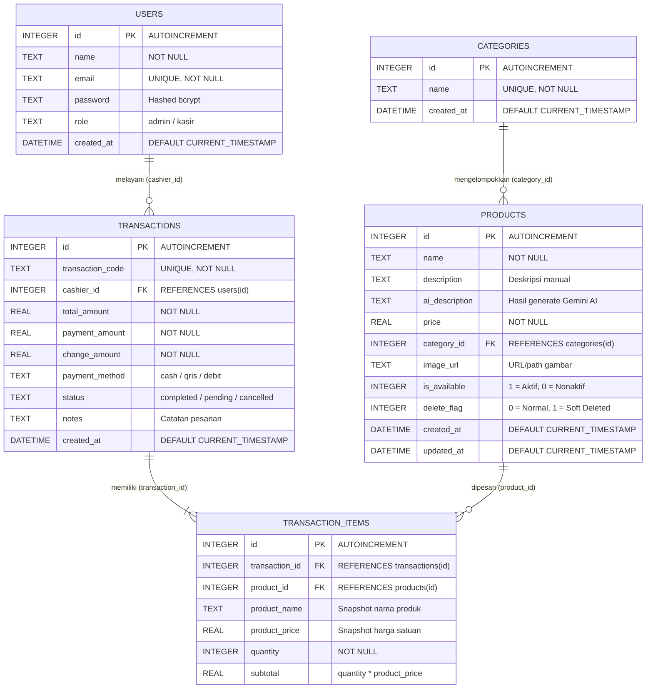

# 🗄️ Dokumentasi Database, Auth & Backend Architecture — BrewMate POS

> **FINAL PROJECT KELOMPOK 1 — PENGEMBANGAN APLIKASI WEB (PAW)**  
> **Penanggung Jawab:** Ilham Saputra (NIM: `20240140118`)  
> **Role:** Backend & Database Developer

---

## 📌 1. Gambaran Umum & Optimasi SQLite Engine

Sistem BrewMate POS menggunakan basis data **SQLite** dengan driver **`better-sqlite3`**, yang merupakan driver SQLite berbasis C++ binding langsung (synchronous) tercepat untuk runtime Node.js. Database dikonfigurasikan dengan serangkaian parameter PRAGMA tingkat lanjut untuk menghasilkan latensi *sub-millisecond*, efisiensi I/O disk, serta kemampuan konkurensi tinggi antara proses baca (*read*) dan tulis (*write*).

### Konfigurasi PRAGMA SQLite (`backend/config/database.js`)
```javascript
const Database = require('better-sqlite3');
const path = require('path');

const DB_PATH = path.join(__dirname, '..', 'coffeeshop.db');

function getDB() {
  if (!db) {
    db = new Database(DB_PATH);
    // 1. Concurrency & Integrity
    db.pragma('journal_mode = WAL');
    db.pragma('foreign_keys = ON');
    db.pragma('synchronous = NORMAL');
    // 2. Memory & Caching
    db.pragma('cache_size = -64000');     // 64 MB Page Cache
    db.pragma('temp_store = MEMORY');     // In-Memory Temporary Sorting
    db.pragma('mmap_size = 268435456');   // 256 MB Memory-Mapped I/O
    db.pragma('busy_timeout = 5000');     // 5000 ms Lock Contention Timeout
  }
  return db;
}
```

### Penjelasan Parameter Optimasi:
| Parameter PRAGMA | Nilai | Tujuan & Dampak Performa |
|---|---|---|
| `journal_mode` | `WAL` | Mengaktifkan **Write-Ahead Logging**. Operasi baca tidak memblokir operasi tulis, dan sebaliknya (konkurensi tinggi). |
| `foreign_keys` | `ON` | Menegakkan integritas referensial relasional antar tabel secara ketat di level DBMS. |
| `synchronous` | `NORMAL` | Menghilangkan fsync berlebih pada mode WAL tanpa mengorbankan durabilitas data saat crash aplikasi. |
| `cache_size` | `-64000` | Mengalokasikan 64 Megabyte RAM sebagai *in-memory cache* untuk halaman database yang sering diakses. |
| `temp_store` | `MEMORY` | Menyimpan tabel sementara (*temp tables*), indeks sementara, dan sorting agregasi langsung di RAM (tidak menulis file temporer ke disk). |
| `mmap_size` | `268435456` | Menggunakan **Memory-Mapped I/O** sebesar 256 MB sehingga query pembacaan data langsung dipetakan ke memori virtual OS tanpa syscall overhead. |
| `busy_timeout` | `5000` | Memberikan toleransi tunggu hingga 5 detik apabila database sedang terkunci oleh transaksi lain, mencegah *SQLITE_BUSY* error. |

---

## 🔐 2. Arsitektur Autentikasi, Keamanan & Config

### A. Sentralisasi Konfigurasi & Immutabilitas (`backend/config/env.js`)
Seluruh variabel lingkungan divalidasi dan dibaca satu kali pada file konfigurasi terpusat. Untuk mencegah modifikasi variabel konfigurasi secara tidak sengaja pada saat runtime, objek dibekukan (*frozen*):
```javascript
const config = {
  port: parseInt(process.env.PORT, 10) || 3000,
  frontendUrl: process.env.FRONTEND_URL || 'http://localhost:5173',
  jwtSecret: process.env.JWT_SECRET || 'coffeeshop_secret_key_kelompok1_paw2026',
  jwtExpiresIn: process.env.JWT_EXPIRES_IN || '8h',
  bcryptSaltRounds: 10,
  geminiApiKey: process.env.GEMINI_API_KEY || '',
  nodeEnv: process.env.NODE_ENV || 'development'
};

module.exports = Object.freeze(config);
```

### B. Keamanan Autentikasi JWT & Enkripsi Kata Sandi
- **Enkripsi Kata Sandi:** Menggunakan algoritma **Bcrypt** dengan salt factor 10 putaran (`bcrypt.hashSync(password, 10)`).
- **Token JWT:** Token ditandatangani menggunakan algoritma HMAC-SHA256 dengan masa aktif terkonfigurasi (default 8 jam).
- **Normalisasi Input:** Email pengguna dinormalisasi dengan `.trim().toLowerCase()` untuk mencegah ketidakcocokan *case-sensitivity*.
- **Role-Based Access Control (RBAC):** Middleware `authorizeAdmin` memverifikasi hak akses pada endpoint mutasi data penting (tambah menu, edit harga, kelola kategori).

---

## 📊 3. Entity Relationship Diagram (ERD)



---

## 📑 4. Struktur Skema & Kamus Data Tabel

### A. Tabel `users`
Menyimpan akun kasir dan administrator sistem.
| Kolom | Tipe Data | Constraint | Keterangan |
|---|---|---|---|
| `id` | `INTEGER` | `PRIMARY KEY AUTOINCREMENT` | ID unik pengguna |
| `name` | `TEXT` | `NOT NULL` | Nama lengkap pengguna |
| `email` | `TEXT` | `UNIQUE NOT NULL` | Email akun (kredensial login) |
| `password` | `TEXT` | `NOT NULL` | Password terenkripsi Bcrypt (10 rounds) |
| `role` | `TEXT` | `DEFAULT 'kasir'` | Role otorisasi (`admin` / `kasir`) |
| `created_at` | `DATETIME` | `DEFAULT CURRENT_TIMESTAMP` | Waktu akun didaftarkan |

### B. Tabel `categories`
Menyimpan kategori pengelompokan menu (Kopi, Non-Kopi, Makanan, Minuman Lain).
| Kolom | Tipe Data | Constraint | Keterangan |
|---|---|---|---|
| `id` | `INTEGER` | `PRIMARY KEY AUTOINCREMENT` | ID unik kategori |
| `name` | `TEXT` | `UNIQUE NOT NULL` | Nama kategori menu |
| `created_at` | `DATETIME` | `DEFAULT CURRENT_TIMESTAMP` | Waktu dibuat |

### C. Tabel `products`
Menyimpan data katalog menu produk, harga, dan integrasi deskripsi Gemini AI.
| Kolom | Tipe Data | Constraint | Keterangan |
|---|---|---|---|
| `id` | `INTEGER` | `PRIMARY KEY AUTOINCREMENT` | ID unik produk |
| `name` | `TEXT` | `NOT NULL` | Nama menu |
| `description` | `TEXT` | `DEFAULT ''` | Deskripsi manual |
| `ai_description`| `TEXT` | `DEFAULT ''` | Deskripsi kreatif hasil Google Gemini AI |
| `price` | `REAL` | `NOT NULL` | Harga jual per unit |
| `category_id` | `INTEGER` | `FOREIGN KEY` | Relasi ke `categories.id` |
| `image_url` | `TEXT` | `DEFAULT ''` | URL foto menu |
| `is_available` | `INTEGER` | `DEFAULT 1` | Ketersediaan (1: Tersedia, 0: Habis) |
| `delete_flag` | `INTEGER` | `DEFAULT 0` | Soft delete flag (0: Aktif, 1: Dihapus) |
| `created_at` | `DATETIME` | `DEFAULT CURRENT_TIMESTAMP` | Waktu pembuatan |
| `updated_at` | `DATETIME` | `DEFAULT CURRENT_TIMESTAMP` | Waktu update terakhir |

### D. Tabel `transactions`
Menyimpan ringkasan transaksi kasir yang selesai.
| Kolom | Tipe Data | Constraint | Keterangan |
|---|---|---|---|
| `id` | `INTEGER` | `PRIMARY KEY AUTOINCREMENT` | ID internal transaksi |
| `transaction_code`| `TEXT` | `UNIQUE NOT NULL` | Kode nota transaksi (`TRX-YYYYMMDD-XXXXXX`) |
| `cashier_id` | `INTEGER` | `NOT NULL, FK` | Relasi ke `users.id` (Kasir yang bertugas) |
| `total_amount` | `REAL` | `NOT NULL` | Total nominal belanja |
| `payment_amount`| `REAL` | `NOT NULL` | Jumlah uang pembayaran |
| `change_amount` | `REAL` | `NOT NULL` | Nominal uang kembalian |
| `payment_method`| `TEXT` | `DEFAULT 'cash'` | Metode pembayaran (`cash`, `qris`, `debit`) |
| `status` | `TEXT` | `DEFAULT 'completed'` | Status pesanan (`completed`, `cancelled`) |
| `notes` | `TEXT` | `DEFAULT ''` | Catatan pesanan |
| `created_at` | `DATETIME` | `DEFAULT CURRENT_TIMESTAMP` | Waktu transaksi |

### E. Tabel `transaction_items`
Menyimpan rincian item produk yang dipesan (snapshot data untuk audit historis).
| Kolom | Tipe Data | Constraint | Keterangan |
|---|---|---|---|
| `id` | `INTEGER` | `PRIMARY KEY AUTOINCREMENT` | ID item transaksi |
| `transaction_id`| `INTEGER` | `NOT NULL, FK` | Relasi ke `transactions.id` |
| `product_id` | `INTEGER` | `NOT NULL, FK` | Relasi ke `products.id` |
| `product_name` | `TEXT` | `NOT NULL` | Snapshot nama menu saat transaksi terjadi |
| `product_price`| `REAL` | `NOT NULL` | Snapshot harga satuan saat transaksi |
| `quantity` | `INTEGER` | `NOT NULL` | Kuantitas pesanan |
| `subtotal` | `REAL` | `NOT NULL` | Subtotal harga (`product_price * quantity`) |

---

## ⚡ 5. Indeks Relasional & Komposit Performa Tinggi

Untuk memaksimalkan kecepatan query pencarian, filter katalog, serta agregasi dashboard, indeks berikut telah diterapkan:

```sql
-- 1. Indeks Katalog Menu Produk
CREATE INDEX IF NOT EXISTS idx_products_category ON products(category_id);
CREATE INDEX IF NOT EXISTS idx_products_delete_flag ON products(delete_flag);
CREATE INDEX IF NOT EXISTS idx_products_composite ON products(category_id, is_available, delete_flag);

-- 2. Indeks Riwayat Transaksi & Filter Tanggal
CREATE INDEX IF NOT EXISTS idx_transactions_cashier ON transactions(cashier_id);
CREATE INDEX IF NOT EXISTS idx_transactions_created_at ON transactions(created_at);
CREATE INDEX IF NOT EXISTS idx_transactions_date_status ON transactions(created_at, status);

-- 3. Indeks Detail Item Transaksi & Analitik Penjualan
CREATE INDEX IF NOT EXISTS idx_transaction_items_trx ON transaction_items(transaction_id);
CREATE INDEX IF NOT EXISTS idx_transaction_items_prod ON transaction_items(product_id);
```

---

## 📈 6. Query Analitik & Agregasi Bisnis (`dashboardController.js`)

### 1. Ringkasan Kategori Terlaris (`top_categories`)
Mengagregasikan penjualan per kategori berdasarkan seluruh item transaksi yang berstatus `completed`:
```sql
SELECT 
  c.id,
  c.name,
  c.name as category_name,
  COALESCE(SUM(ti.quantity), 0) as total_sold,
  COALESCE(SUM(ti.subtotal), 0) as total_revenue
FROM transaction_items ti
JOIN products p ON ti.product_id = p.id
JOIN categories c ON p.category_id = c.id
JOIN transactions t ON ti.transaction_id = t.id
WHERE t.status = 'completed'
GROUP BY c.id, c.name
ORDER BY total_sold DESC;
```

### 2. Top 5 Produk Terlaris (`top_products`)
```sql
SELECT 
  p.name, p.price, c.name as category, 
  SUM(ti.quantity) as total_sold,
  SUM(ti.subtotal) as total_revenue
FROM transaction_items ti
JOIN products p ON ti.product_id = p.id
LEFT JOIN categories c ON p.category_id = c.id
GROUP BY p.id
ORDER BY total_sold DESC
LIMIT 5;
```

### 3. Agregasi Pendapatan Hari Ini & Bulan Ini
```sql
-- Omzet Hari Ini
SELECT COUNT(*) as total_transactions, COALESCE(SUM(total_amount), 0) as total_revenue
FROM transactions 
WHERE DATE(created_at) = ? AND status = 'completed';

-- Omzet Bulan Ini
SELECT COUNT(*) as total_transactions, COALESCE(SUM(total_amount), 0) as total_revenue
FROM transactions 
WHERE strftime('%Y-%m', created_at) = ? AND status = 'completed';
```

---

## 🔒 7. Integritas Transaksi Kasir (Atomic ACID Transaction)

Proses pembuatan transaksi kasir (`POST /api/transactions`) dibungkus dalam blok transaksi native SQLite (`db.transaction()`):
```javascript
const insertTransaction = db.transaction(() => {
  const result = db.prepare(`
    INSERT INTO transactions (transaction_code, cashier_id, total_amount, payment_amount, change_amount, payment_method, notes)
    VALUES (?, ?, ?, ?, ?, ?, ?)
  `).run(transaction_code, cashier_id, total_amount, parseFloat(payment_amount), change_amount, payment_method, notes);

  const transaction_id = result.lastInsertRowid;

  for (const item of itemDetails) {
    db.prepare(`
      INSERT INTO transaction_items (transaction_id, product_id, product_name, product_price, quantity, subtotal)
      VALUES (?, ?, ?, ?, ?, ?)
    `).run(transaction_id, item.product.id, item.product.name, item.product.price, item.quantity, item.subtotal);
  }

  return transaction_id;
});
```
*Jaminan:* Seluruh perubahan data master transaksi dan detail item transaksi bersifat atomik (semua tersimpan sempurna atau di-rollback otomatis secara penuh jika terjadi error).

---

## ✅ 8. Rekap Status Pengerjaan (Ilham Saputra — Backend & Database)

| No | Modul / Fitur | Status | File Implementasi |
|---|---|:---:|---|
| 1 | Skema 5 Tabel Relasional SQLite | ✅ Selesai | [database.js](file:///c:/SEMESTER%20ANTARA/PENGEMBANGAN%20APLIKASI%20WEB/PAW%20FINAL%20PROJECT/backend/config/database.js) |
| 2 | Optimasi Tingkat Lanjut SQLite Engine (WAL, Memory, Cache, MMAP) | ✅ Selesai | [database.js](file:///c:/SEMESTER%20ANTARA/PENGEMBANGAN%20APLIKASI%20WEB/PAW%20FINAL%20PROJECT/backend/config/database.js) |
| 3 | Indeks Komposit Performa Query | ✅ Selesai | [database.js](file:///c:/SEMESTER%20ANTARA/PENGEMBANGAN%20APLIKASI%20WEB/PAW%20FINAL%20PROJECT/backend/config/database.js) |
| 4 | Sentralisasi Konfigurasi & Immutabilitas (`Object.freeze`) | ✅ Selesai | [env.js](file:///c:/SEMESTER%20ANTARA/PENGEMBANGAN%20APLIKASI%20WEB/PAW%20FINAL%20PROJECT/backend/config/env.js) |
| 5 | Autentikasi JWT & Keamanan Bcrypt (10 Rounds) | ✅ Selesai | [auth.js](file:///c:/SEMESTER%20ANTARA/PENGEMBANGAN%20APLIKASI%20WEB/PAW%20FINAL%20PROJECT/backend/config/auth.js), [authController.js](file:///c:/SEMESTER%20ANTARA/PENGEMBANGAN%20APLIKASI%20WEB/PAW%20FINAL%20PROJECT/backend/controllers/authController.js) |
| 6 | Transaksi Kasir Atomic ACID (`db.transaction()`) | ✅ Selesai | [transactionController.js](file:///c:/SEMESTER%20ANTARA/PENGEMBANGAN%20APLIKASI%20WEB/PAW%20FINAL%20PROJECT/backend/controllers/transactionController.js) |
| 7 | Query Agregasi Dashboard & `top_categories` | ✅ Selesai | [dashboardController.js](file:///c:/SEMESTER%20ANTARA/PENGEMBANGAN%20APLIKASI%20WEB/PAW%20FINAL%20PROJECT/backend/controllers/dashboardController.js) |
| 8 | Modul Endpoint Kategori CRUD (`/api/categories`) | ✅ Selesai | [categoryController.js](file:///c:/SEMESTER%20ANTARA/PENGEMBANGAN%20APLIKASI%20WEB/PAW%20FINAL%20PROJECT/backend/controllers/categoryController.js), [categoryRoutes.js](file:///c:/SEMESTER%20ANTARA/PENGEMBANGAN%20APLIKASI%20WEB/PAW%20FINAL%20PROJECT/backend/routes/categoryRoutes.js) |
| 9 | Soft Delete Pattern pada Produk | ✅ Selesai | [productController.js](file:///c:/SEMESTER%20ANTARA/PENGEMBANGAN%20APLIKASI%20WEB/PAW%20FINAL%20PROJECT/backend/controllers/productController.js) |
| 10 | Dokumentasi Lengkap Database, Auth & API | ✅ Selesai | [database.md](file:///c:/SEMESTER%20ANTARA/PENGEMBANGAN%20APLIKASI%20WEB/PAW%20FINAL%20PROJECT/backend/database.md), [backend/README.md](file:///c:/SEMESTER%20ANTARA/PENGEMBANGAN%20APLIKASI%20WEB/PAW%20FINAL%20PROJECT/backend/README.md) |
